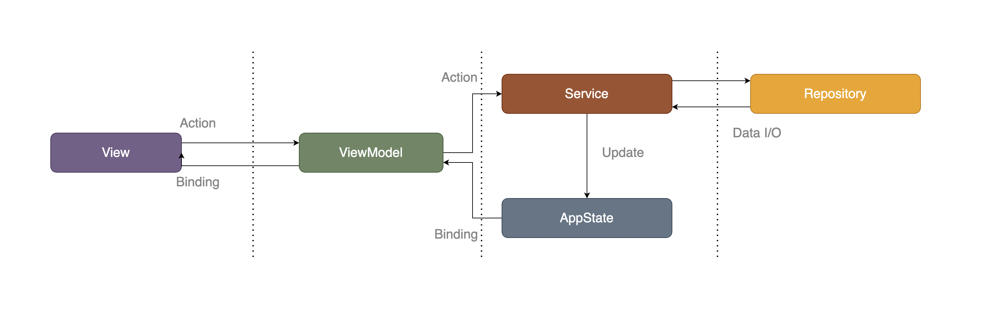
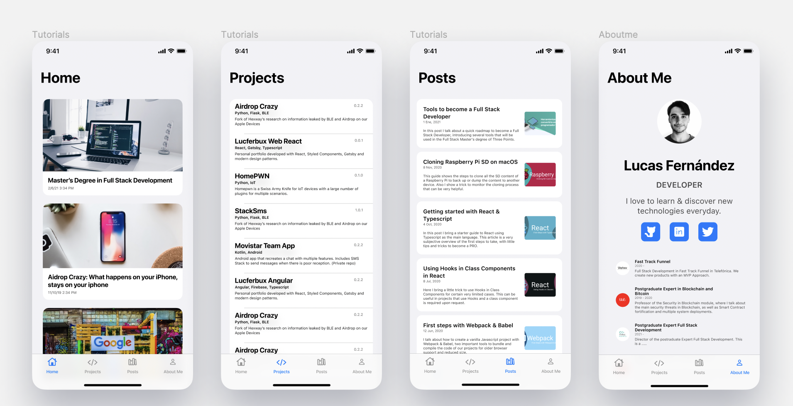

# Lucferbux iOS

> Portfolio in SwiftUI

## TestFlight

You can join the app in the [TestFlight List](https://testflight.apple.com/join/Ua46Z85F)

## Introduction

The application uses Clean Architecture based on MVVM and SwiftUI. Implemented
Architecture principles follow Apple recommended [SwiftUI Architecture](https://developer.apple.com/tutorials/swiftui).

The application is written entirely in Swift.

SwiftUI is used as an Architecture glue including but not limited to Combine, Firebase & UIKit.

The application does network over Firebase SDK, then it uses the offline capabilities to store data.

This app is targeted to run in the following OS:

* iOS (iPhone / iPad)
* WatchOS
* macOS

This app consist in several views:

* Navigation Sections
* In App Browser
* Detailed View Navigation
* Future ARKit View

## Getting Started

To install this project:

* Clone or download this repository
* Change the developer ID
* Build a targeted version.

## Screenshots

